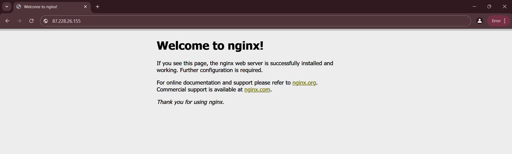
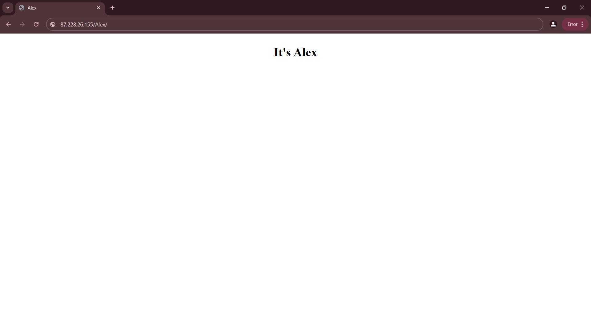
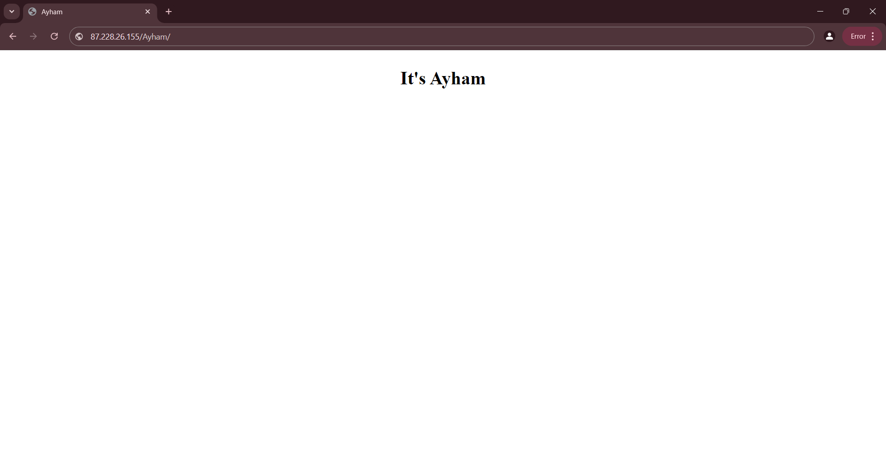
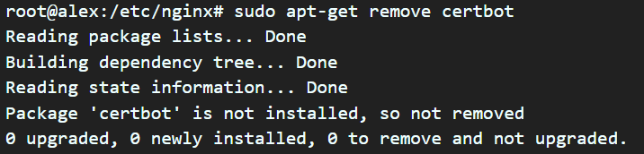
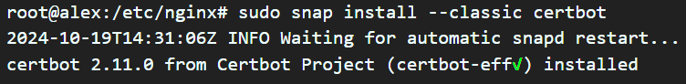
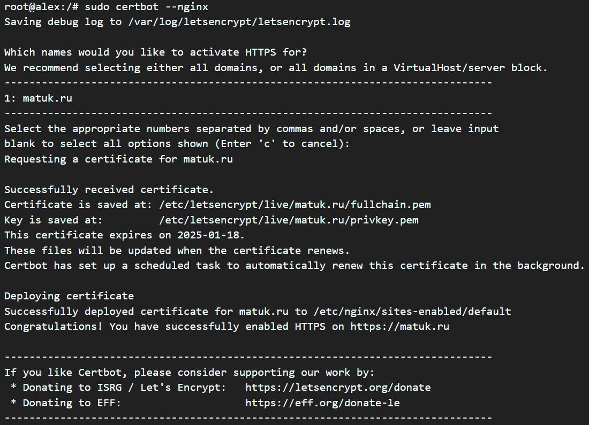
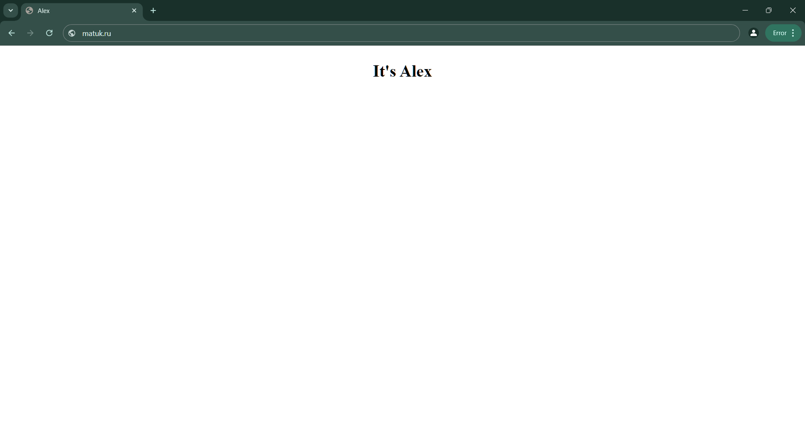
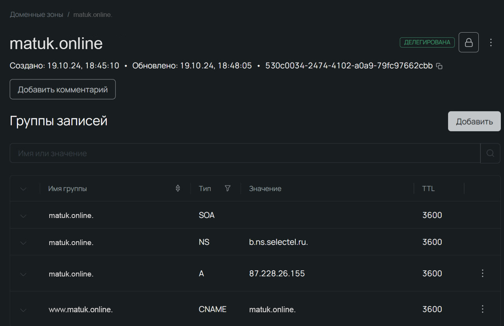
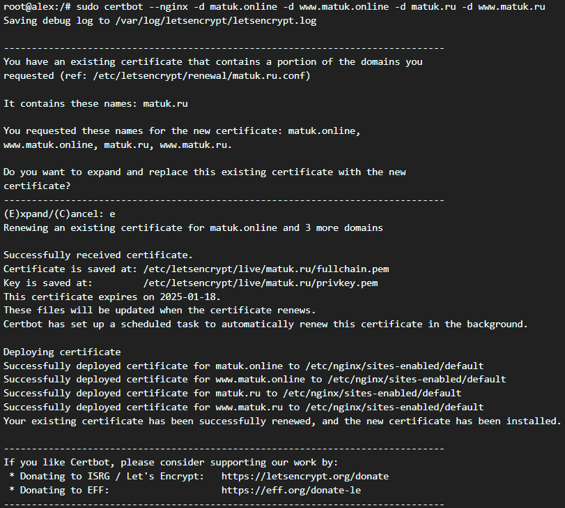

# First laboratory work on the subject "Cloud technologies and services"

## Technical Task

1. **Must work over HTTPS with a certificate**
2. **Configure forced redirection of HTTP requests (port 80) to HTTPS (port 443)**
3. **Use alias to create aliases for paths to files or directories on the server**
4. **Configure virtual hosts to serve multiple domain names on the same server**
5. **Anything else to meet the requirements of the project**

## Getting started

1. **Cloud server rental and connection:**

   - We rented a cloud server and established an SSH connection.
   - Connected via SSH-Remote in VS Code.

2. **Updating packages:**'

   ```bash
   sudo apt update
   ```

3. **Installed git and nginx**

   ```bash
   sudo apt install git nginx
   ```

4. **Install successfully**

<p style="text-align:center;"></p>

Working successfully

5. **First ngnix setup**

- We copied the necessary files for the lab to work and moved them along the paths /var/www/Ayham/ and /var/www/Alex/ and immediately registered aliases

  ```nginx
  server {
      listen 80;
      server_name 87.228.26.155;

      location /Ayham/ {
          alias /var/www/Ayham/;
          try_files $uri /index.html =404;
      }

      location / {
          alias /var/www/Alex/;
          try_files $uri /index.html =404;
      }

      error_page 404 /404.html;
      location = /404.html {
          root /var/www/html;
          internal;
      }
  }
  ```

<p style="text-align:center;"></p>
<p style="text-align:center;"></p>

## Domain

1. **Domain Connection**

   - Put we bought a domain matuk.ru
   - Wait for domain delegation

2. **Waiting for delegation**

   - A couple of hours later, the domain was connected to our ip address and now we have

   ```nginx
   server {
       listen 80;
       server_name matuk.ru;

       location /Ayham/ {
           alias /var/www/Ayham/;
           try_files $uri /index.html =404;
       }

       location / {
           alias /var/www/Alex/;
           try_files $uri /index.html =404;
       }

       error_page 404 /404.html;
       location = /404.html {
           root /var/www/html;
           internal;
       }
   }
   ```

## Getting an SSL certificate and configuring redirection

1. **Working through certbot, then go through the documentation on website:**

   ```bash
   sudo apt-get remove certbot
   ```

   <p style="text-align:center;"></p>

   - For the command in the next step, you need to install:

   ```bash
   sudo apt-get install snapd
   ```

   ```bash
   sudo snap install --classic certbot
   ```

    <p style="text-align:center;"></p>

   - Go to the root of the system and prescribe:

   ```bash
   sudo ln -s /snap/bin/certbot /usr/bin/certbot
   ```

   ```bash
   sudo certbot --nginx
   ```

   <p style="text-align:center;"></p>

   - Receiving the certificate, and certbot automatically configured the nginx file

   <p style="text-align:center;"></p>

   - Configuration code:

     ```nginx
     server {
         listen 80;
         server_name matuk.ru www.matuk.ru;

         return 301 https://$host$request_uri;
     }

     server {
         listen 443 ssl;
         server_name matuk.ru www.matuk.ru;

         ssl_certificate /etc/letsencrypt/live/matuk.ru/fullchain.pem;
         ssl_certificate_key /etc/letsencrypt/live/matuk.ru/privkey.pem;
         include /etc/letsencrypt/options-ssl-nginx.conf;
         ssl_dhparam /etc/letsencrypt/ssl-dhparams.pem;

         location /Ayham/ {
             alias /var/www/Ayham/;
             try_files $uri /index.html =404;
         }

         location / {
             alias /var/www/Alex/;
             try_files $uri /index.html =404;
         }

         error_page 404 /404.html;
         location = /404.html {
             root /var/www/html;
             internal;
         }
     }

     ```

## Connecting another domains

1. **We need to do the same operations as with connecting the first domain, and wait for the delegation**

   <p style="text-align:center;"></p>

2. **Configuration file now contains the following domains:**

   ```bash
   server_name matuk.ru www.matuk.ru matuk.online www.matuk.online
   ```

3. **Writing this command and restart nginx**

   ```bash
   sudo certbot --nginx -d matuk.online -d www.matuk.online -d matuk.ru -d www.matuk.ru
   ```

   ```bash
   sudo systemctl restart nginx
   ```

   <p style="text-align:center;"></p>

4. **The configuration code after:**

   ```nginx
   server {
       if ($host = www.matuk.ru) {
           return 301 https://$host$request_uri;
       }


       if ($host = matuk.ru) {
           return 301 https://$host$request_uri;
       }


       if ($host = www.matuk.online) {
           return 301 https://$host$request_uri;
       }


       if ($host = matuk.online) {
           return 301 https://$host$request_uri;
       }


       listen 80;
       server_name matuk.ru www.matuk.ru matuk.online www.matuk.online;

       return 301 https://$host$request_uri;

   }

   server {
       listen 443 ssl;
       server_name matuk.ru www.matuk.ru matuk.online www.matuk.online;
       ssl_certificate /etc/letsencrypt/live/matuk.ru/fullchain.pem;
       ssl_certificate_key /etc/letsencrypt/live/matuk.ru/privkey.pem;
       include /etc/letsencrypt/options-ssl-nginx.conf;
       ssl_dhparam /etc/letsencrypt/ssl-dhparams.pem;

       location /Ayham/ {
           alias /var/www/Ayham/;
           try_files $uri /index.html =404;
       }

       location / {
           alias /var/www/Alex/;
           try_files $uri /index.html =404;
       }

       error_page 404 /404.html;
       location = /404.html {
           root /var/www/html;
           internal;
       }

   }
   ```
