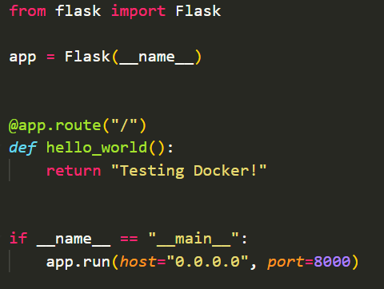
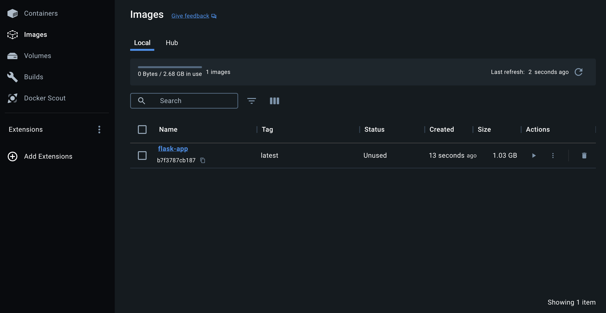
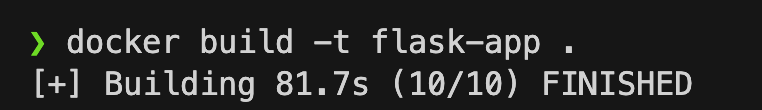
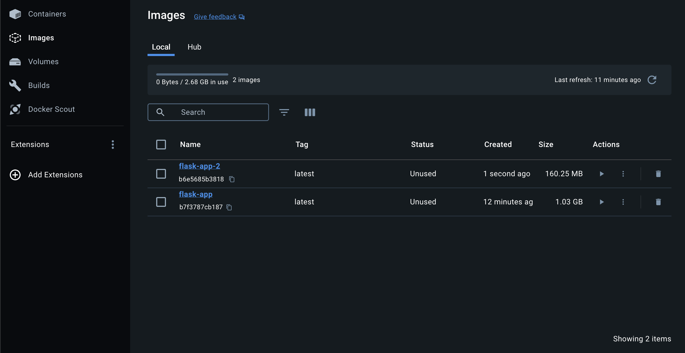
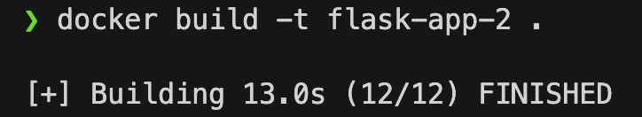

# Second laboratory work on the subject "Cloud technologies and services"

## Technical specification

1. **Write a “bad” Dockerfile that has at least three “bad practices” on writing dockerfiles**
2. **Write “good” A dockerfile in which these bad practices are fixed**
3. **In the Readme, describe each of the bad practices in a bad dockerfile, why it is bad and how it was fixed in a good one, how the correction affected the result**
4. **In the Readme, describe 2 bad practices for working with containers. ! Not by writing docker files, but about how even using a good docker file you can mess up exactly when working with containers.**

## Getting started

1. **First we need to write a Python app, then write docker files for it**

<p style="text-align:center;"></p>

2. **Writing a “bad” Dockerfile using several “bad practices”**

   ```
   FROM python:latest

   USER root

   WORKDIR /app

   COPY . .

   RUN pip install --no-cache-dir -r requirements.txt

   CMD ["python", "app.py"]
   ```

3. **Creating an image based on the “bad” Dockerfile**

   `docker build -t flask-app .`

<p style="text-align:center;"></p>

<p style="text-align:center;"></p>

4. **Writing “good” Dockerfile using several “good practices”**

   ```
   FROM python:3.11-slim

   RUN useradd -ms /bin/bash ayham_user

   USER ayham_user

   WORKDIR /app

   COPY requirements.txt .

   RUN pip install --no-cache-dir -r requirements.txt

   COPY app.py .

   CMD ["python", "app.py"]
   ```

5. **Creating an image based on a “good” Dockerfile**

   `docker build -t flask-app-2 .`

<p style="text-align:center;"></p>

<p style="text-align:center;"></p>

6. **Conclusion**

   An image built from a poorly optimized Dockerfile is noticeably slower to assemble and significantly larger compared to one built from a well-optimized Dockerfile.

## Dockerfile Bad Practices

### 1. Not specifying a specific image version.

- **Why it’s bad:**

  - **Unpredictability:** Using the `latest` tag does not guarantee that the image will always remain the same. If the base image changes (for example, a new version of Python), it may cause compatibility issues or unexpected behavior in your application.

  - **Reproducibility issues:** Future container builds or builds on different servers may yield different results since `latest` will point to a different image version.

### 2. Running the container as root.

- **Why it’s bad:**

  - **Security risks:** By default, a container runs as the `root` user, which increases the risk of vulnerability exploitation. If an attacker gains access to the container, they will have `root` privileges.

  - **Poor security practices:** Even though the container is isolated, running as root heightens the risk of attacks on other systems.

### 3. Installing dependencies after copying files.

- **Why it’s bad:**

  - **Inefficient cache usage:** Each time the code (e.g., `app.py`) is changed, Docker needs to reinstall all dependencies, even if they haven’t changed. This increases build time and makes the process less efficient.

  - **Larger image size:** Each build step creates a new layer in the image, and if dependencies are changed frequently, the image size may grow significantly.

### 4. Copying all files into the container without using `.dockerignore` (thus increasing Dockerfile size).

- **Why it’s bad:**

  - **Unnecessary files in the image:** All files from the working directory will be copied into the container, including temporary files, documentation, editor configuration files, and other unnecessary files. This increases the size of the Docker image.

  - **Slower build process:** A large number of unnecessary files will slow down the copying process, and as a result, the build process.

## Dockerfile Best Practices

### 1. Use a tag to specify the image version.

- **Fix:**

  - **Version specification:** Using a specific version tag (e.g., `python:3.11-slim`) ensures that you are always working with the same version of Python. This guarantees stability.

- **Impact:**

  - **Predictability:** The build process will always use the same environment, regardless of changes in the base image repository.

  - **Optimized size:** Using the `slim` tag significantly reduces the size of the image.

### 2. Create a non-root user to avoid running the container as root.

- **Fix:**

  - **Create a non-root user:** Create a new user and switch to it using the `USER` command. This minimizes the attack surface since the container will run with minimal privileges.

- **Impact:**

  - **Enhanced security:** The container does not run as `root`, which greatly reduces the risk of vulnerability exploitation in the event of an attack.

### 3. Install dependencies first, then copy files.

- **Fix:**

  - **Install dependencies first:** Copy the `requirements.txt` file and install dependencies before copying the rest of the application files. This allows Docker to cache layers effectively and speeds up the build if only the application code changes.

- **How this improves things:**

  - **Optimized build process:** Docker can cache layers, so if only the application code changes, dependencies don’t need to be reinstalled, speeding up the build process.

  - **Reduced image size:** Fewer changing layers result in a smaller final Docker image.

### 4. Copy only the necessary files and use a `.dockerignore` file.

- **Fix:**

  - **Use a `.dockerignore` file:** This file excludes unnecessary files (e.g., temporary files, editor configuration files, etc.) that aren’t needed for the application to run inside the container.

- **Impact:**

  - **Smaller image size:** Fewer unnecessary files are copied into the container, reducing the overall image size.

  - **Faster build process:** Less data needs to be copied, which shortens the build time.

## Common Bad Practices with Containers

### 1. Not updating images and containers.

- **Consequences:**

  - **Security vulnerabilities:** Using outdated images can leave your application vulnerable to attacks that have been fixed in newer image versions.

  - **Compatibility issues:** New dependencies or changes in programming languages can cause problems when interacting with outdated libraries or frameworks.

- **Recommendations:**

  Regularly check and update images to ensure that you are using the latest versions with up-to-date security patches and improvements.

### 2. Not setting resource limits for containers.

- **Consequences:**

  - **Performance degradation:** If one container consumes all available resources, other containers may not get enough resources, leading to slowdowns or even system crashes.

  - **Unexpected crashes:** If resources are exhausted, containers or even the Docker daemon may crash unexpectedly, causing data loss or service outages.

- **Recommendations:**

  When launching containers, use the `--memory` and `--cpus` parameters to limit the resources your containers can use. This helps prevent performance issues and ensures more stable operation across all containers on the host.
